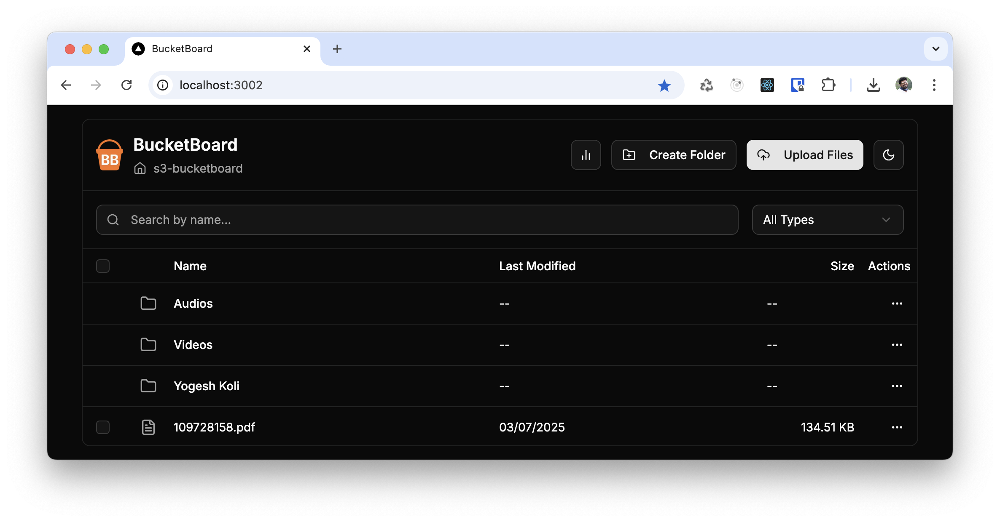

# 🪣 BucketBoard

**BucketBoard** is a modern, open-source web application for managing AWS S3 buckets through a clean, drag-and-drop UI — no AWS Console or CLI required.

 

---

## 🚀 Features

- ✅ **Full File Management:** Upload, download, preview, rename, and delete files and folders.
- ✅ **Intuitive Interface:** Organize with drag-and-drop moving and view details in a properties panel.
- ✅ **Bulk Actions:** Select and delete multiple files at once.
- ✅ **Secure Sharing:** Generate time-limited, secure links (pre-signed URLs).
- ✅ **Powerful Search:** Instantly find files with client-side search and filtering.
- ✅ **Storage Analytics:** Visualize bucket usage with an interactive dashboard.
- ✅ **Editable Metadata:** View and edit S3 object tags directly from the properties panel.
- ✅ **Modern UI:** A clean, responsive interface with light and dark modes.
- ✅ **Dockerized:** Simple setup with `docker-compose up`.

---

## 🛠 Tech Stack

| Layer        | Tech                                     |
|--------------|------------------------------------------|
| Frontend     | [Next.js](https://nextjs.org/), [Tailwind CSS](https://tailwindcss.com/), [shadcn/ui](https://ui.shadcn.com/) |
| Backend      | Node.js (Express), AWS SDK (S3)          |
| Storage      | AWS S3 or compatible (MinIO, Wasabi, etc) |
| Dev Tools    | Docker, Docker Compose, pnpm             |

---

## 📦 Project Structure

```
bucketboard/
├── frontend/          # Next.js app
│   └── ...            # UI components, pages, styles
├── backend/           # Node.js Express API
│   └── ...            # API routes for S3
├── docker/            # Docker-related config (optional)
├── docker-compose.yml
└── README.md
```

---

## ⚙️ Getting Started

### 1. Clone the Repository

```bash
git clone https://github.com/yogeshkoli/bucketboard.git
cd bucketboard
```

### 2. Create `.env` file

Create `.env` at the root of the project and add your AWS credentials:

```env
AWS_ACCESS_KEY_ID=your-access-key
AWS_SECRET_ACCESS_KEY=your-secret-key
AWS_REGION=your-region
AWS_BUCKET_NAME=your-bucket
```

### 3. Install Dependencies (if not using Docker)

```bash
cd backend && pnpm install
cd ../frontend && pnpm install
```

### 4. Run Locally with Docker

```bash
docker-compose up --build
```

- Frontend: [http://localhost:3000](http://localhost:3000)
- Backend: [http://localhost:5000](http://localhost:5000)

---

## 📄 API Endpoints

| Method | Endpoint                    | Description                                          |
|--------|-----------------------------|------------------------------------------------------|
| GET    | `/api/files`                | List files and folders, including storage class.     |
| GET    | `/api/analytics`            | Get aggregated data for the analytics dashboard.     |
| GET    | `/api/files/metadata`       | Get S3 object tags for a specific file.              |
| POST   | `/api/files/metadata`       | Update S3 object tags for a specific file.           |
| POST   | `/api/upload/presigned-url` | Generate a pre-signed URL for file uploads.          |
| POST   | `/api/files/presigned-url`  | Generate a pre-signed URL for previews or downloads. |
| POST   | `/api/share/presigned-url`  | Generate a pre-signed URL for secure file sharing.   |
| POST   | `/api/download/folder`      | Download an entire folder as a zip archive.          |
| POST   | `/api/folders`              | Create a new folder (empty object with a `/`).       |
| POST   | `/api/rename`               | Rename/move a file or folder.                        |
| DELETE | `/api/files`                | Delete a single file.                                |
| DELETE | `/api/files/bulk`           | Delete multiple files in a single request.           |

---

## 📈 Roadmap

- [ ] User Authentication (JWT or Cognito)
- [ ] Role-based access control
- [ ] Support multiple buckets
- [ ] Multi-tenant mode

---

## 🤝 Contributing

Contributions are welcome! Please see our [Contributing Guide](./CONTRIBUTING.md) for more details on how to get started.

---

## 📄 License

[MIT](LICENSE)

---

## 🙏 Acknowledgements

- [shadcn/ui](https://ui.shadcn.com/)
- [AWS SDK for JavaScript](https://docs.aws.amazon.com/AWSJavaScriptSDK/latest/)
- [Recharts](https://recharts.org/)